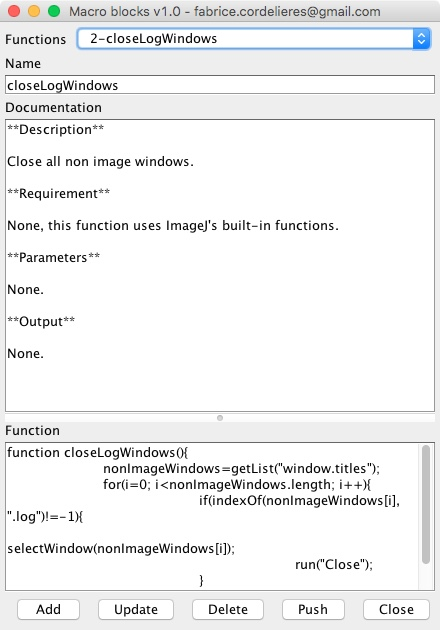

# macroBricks
macroBricks is an ImageJ plugin dedicated at keeping track of your most useful user-defined macro functions.
This software also works in stand-alone mode.

## How to install/run it ?

1. Download the macroBrick_.jar file from the [release section](https://github.com/fabricecordelieres/IJ_macroBricks/releases).
2. To run it directly as a stand-alone software, double-click on the file (a Java Virtual Machine is required).
3. To use it as part of the ImageJ environment, drag-and-drop the file to the ImageJ's toolbar. When asked, save the file to the proposed folder.

## GUI

The plugin's GUI is quite simple, made of five areas:
* **Functions:** allows selecting one function, if any is available;
* **Name:** either displays the function's name when in review mode or allows entering a new one;
* **Documentation:** either displays the function's description when in review mode or allows entering a new one;
* **Function:** either displays the function's code when in review mode or allows entering a new one.
* **Buttons' area:** allows performing specific action:
    * *Add:* switches the interface into addition mode, to create a new item. Once done, une the "Save" button to validate;
    * *Update:* switches the interface into editing mode, to modifiy an existing item. Once done, une the "Save" button to validate;
    * *Delete:* deletes the currently selected item. Once done, une the "Save" button to validate;
    * *Push:* sends the currently selected function to the macro recorder. if none is opened, it starts a new instance. This button is absent when in stand-alone mode;
    * *Close:* closes the macroBrick window.
    
## What does it do ?
This plugin allows keeping track of your user-defined ImageJ macro functions. All functions are stored in a file located **in the installation folder of your ImageJ software**. The function repository is saved as a **markdown file**, hence the importance of the documentation part. By using proper field formatting, you may end up having a nicely formatted document you could share with collaborators, explaining what the functions are actually made for and how to use them !
